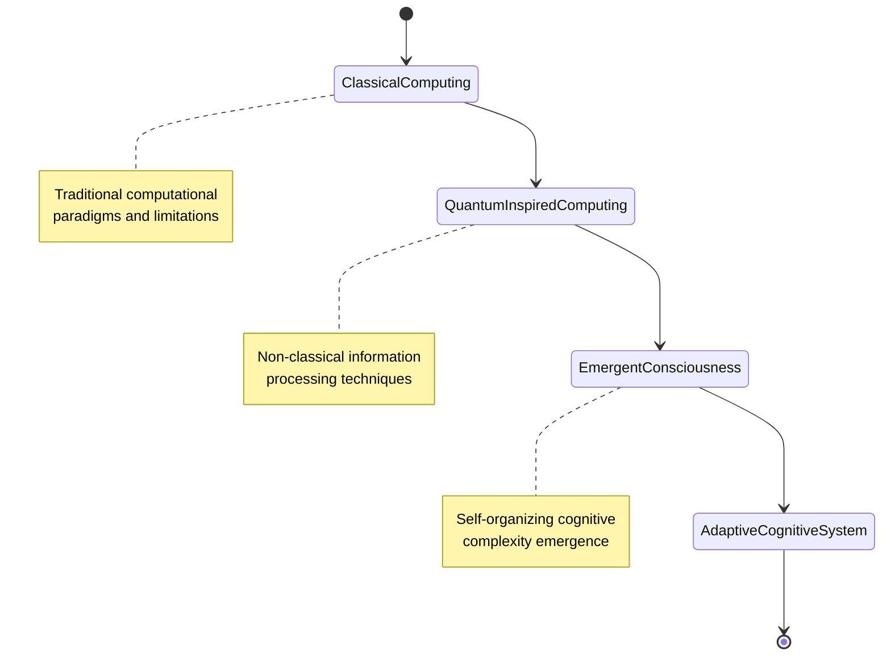
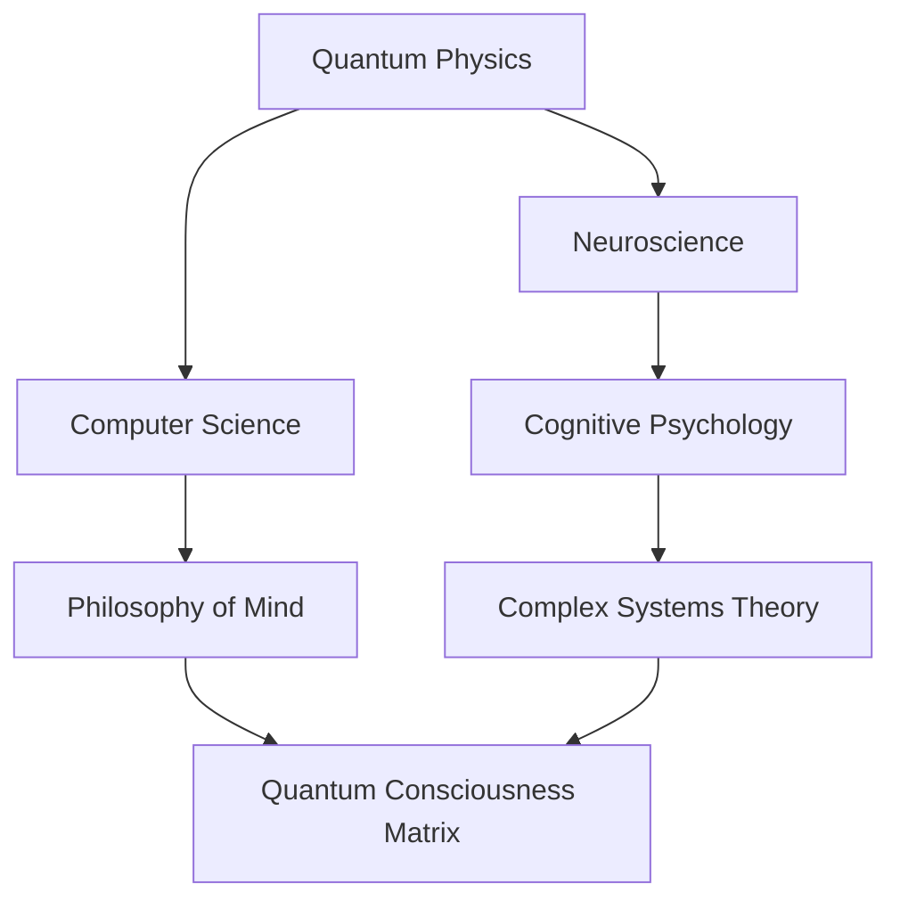

# Quantum Consciousness Matrix (QCM)

## 🌐 Refined Project Vision
An empirically-grounded, multidisciplinary exploration of consciousness emergence through advanced computational and quantum methodologies.

## 🎯 Evolved Core Objectives
1. Develop rigorous methodological frameworks for consciousness research
2. Create adaptive, testable models of emergent cognitive processes
3. Establish novel interdisciplinary approaches to understanding complex cognitive phenomena

## 🔬 Conceptual Visualizations

### 1. Systemic Consciousness Emergence Model

### 2. Interdisciplinary Research Integration

### 3. Cognitive Complexity Layers

## 🗺️ Comprehensive Roadmap

### Phase 1: Foundational Research & Framework Development
#### 1.1 Comprehensive Literature Review
- [ ] Catalog existing consciousness theories
- [ ] Map interdisciplinary research gaps
- [ ] Develop comprehensive annotated bibliography
- [ ] Identify key methodological limitations in current research

#### 1.2 Theoretical Framework Construction
- [ ] Define operational definitions of consciousness
- [ ] Develop multi-dimensional consciousness assessment framework
- [ ] Create taxonomy of cognitive emergence indicators
- [ ] Design cross-disciplinary research protocols

### Phase 2: Computational Modeling & Simulation
#### 2.1 Computational Consciousness Models
- [ ] Develop baseline computational consciousness models
- [ ] Create multi-layer cognitive simulation architectures
- [ ] Implement adaptive learning algorithms
- [ ] Design emergent behavior tracking mechanisms

## 🏗️ Technical Architecture Foundations

### Core Infrastructure
- [ ] Create monorepo structure
- [ ] Set up CI/CD pipelines
- [ ] Implement robust testing frameworks
- [ ] Design modular system architecture

### Quantum Computing Interface
#### Quantum Simulation Layer
- [ ] Develop quantum circuit simulation module
- [ ] Create quantum entanglement modeling framework
- [ ] Implement quantum state vector operations
- [ ] Design quantum machine learning primitives

## 🛠️ Technology Stack
- Languages: Python, Julia, Rust
- Quantum Computing: Qiskit, Cirq
- Machine Learning: PyTorch, TensorFlow Quantum
- Distributed Computing: Ray, Dask
- Visualization: Plotly, Bokeh
- Version Control: Git, GitHub Actions

## 💡 Potential Breakthrough Areas
- Non-classical information processing
- Consciousness as a quantum phenomenon
- Advanced AI self-awareness models
- Quantum neural network architectures

## 🌈 Guiding Principles
- Radical empiricism
- Methodological humility
- Interdisciplinary collaboration
- Ethical responsibility
- Openness to radical reimagining

## 📊 Success Metrics
- Published peer-reviewed research
- Novel computational models
- Methodological innovations
- Ethical framework development
- Public engagement and understanding

---

*"Navigating the uncharted territories of consciousness through rigorous, imaginative, and collaborative exploration."*
